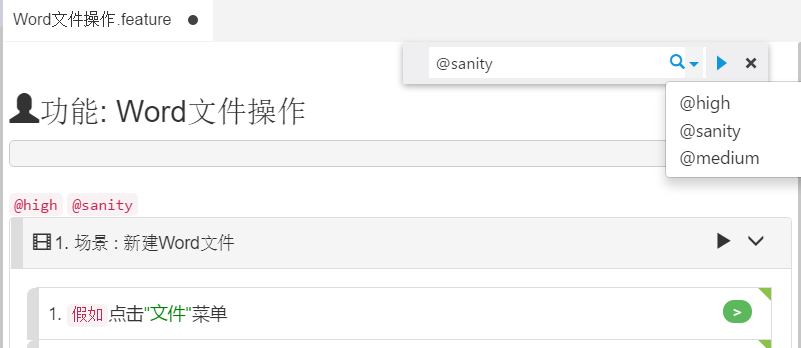

# 标签

标签可以被添加到一个剧本文档的不同元素上，包括剧本(Feature)、场景(Scenario)和示例(Example)等。每个标签必须以`"@"`作为前缀。在[可视模式](/features/visual_mode.md) 下编辑时, 可以双击某个元素的开始部分添加标签。如果你输入一个没有`"@"`的标签，编辑器会在你输入完成后为你添加它。例如，如果要在剧本上添加标签，则在一个剧本的标题上部双击，进入标签编辑状态，然后输入标签，多个标签以空格隔开。

## 剧本文档中的标签
下面的例子显示了一个加满标签的剧本文件：

```gherkin
# language: zh-CN
@math
功能: 加法
  为了避免一些愚蠢的错误
  作为一个数学白痴
  我希望有人告诉我数字相加的结果

  @sanity
  场景: 两个数相加
    假如我已经在计算器里输入6
    而且我已经在计算器里输入7
    当我按"相加"按钮
    那么我应该在屏幕上看到的结果是13

  @uat
  场景大纲: 三个数相加
    假如我已经在计算器里输入<数据1>
    而且我已经在计算器里输入<数据2>
    而且我已经在计算器里输入<数据3>
    当我按"<操作按钮>"按钮
    那么我应该在屏幕上看到的结果是<结果>
    例子: 
      | 数据1 | 数据2 | 数据3 | 操作按钮 | 结果 |
      | 12    | 2    | 3     | 相加     | 17  |
    @complete
    例子: 
      | 数据1 | 数据2 | 数据3 | 操作按钮 | 结果 |
      | 242   | 111  | 23    | 相加    | 376  |
```
上面样例的剧本、场景及场景大纲中的例子中都加入了标签。

标签主要在编辑和执行的时候用于过滤。


## 标签过滤框

在“可视”视图编辑时，可以用标签过滤文档的显示，可以点击菜单`"查看"`-> `"过滤标签…"`，一个过滤框就会显示出来。



标签过滤框可用于过滤一个剧本文档以供显示或执行。输入标签名称并按下回车键，文档将只显示符合标签的场景。除了手动输入标签名外，您也可以单击下拉箭头来选择文档中的某个标签。

输入标签后，您可以点击过滤框中的箭头按钮来运行带有这些标签的场景，其它不匹配标签的场景将不会被运行。

> **注意**：标签如果加在剧本上，相当于它应用在剧本中的每一个场景上，在过滤框中输入这个标签，剧本的所有场景都能够匹配。

<a id="run"></a>
## 执行时的过滤

执行项目时可以通过配置过滤标签配置要运行的场景。配置方法，新建一个运行配置，在配置的“标签过滤器”中填入标签表达式。有关如何创建配置，请参见[运行配置](/execution/profiles.md)。

执行时可使用一个或多个标签，用"AND"或"OR"组合形成标签表达式来过滤。例如上面的剧本文件中, "@math and @sanity" 表达式会执行第一个场景，即“两个数相加”。"@sanity or @uat"会执行第一个场景“两个数相加”和第二个场景大纲“三个数相加”。“@complete"只会用它标记的那个表格数据执行场景大纲。

更多信息请参见[标签表达式](https://docs.cucumber.io/cucumber/api/#tag-expressions)